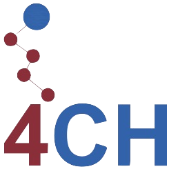

# Team

- Project coordinator: Dr Gabriele Salciute Civiliene, Lecturer in Digital Humanities, DDH, King's College London, [gabriele.salciute-civiliene@kcl.ac.uk](mailto:gabriele.salciute-civiliene@kcl.ac.uk)
- Project website coordinator: Maria Dermentzi, Research Assistant, DDH, King's College London, [maria.1.dermentzi@kcl.ac.uk](mailto:maria.1.dermentzi@kcl.ac.uk)
- Asset inventory coordinator TBC
- Data coordinators:
  - Strand 1 (3d data) TBC
  - Strand 2 (images and videos): Ellen Charlesworth, Doctoral Student, Durham University, [ellen.m.charlesworth@durham.ac.uk](mailto:ellen.m.charlesworth@durham.ac.uk)
  - Strand 3 (research outputs): Inna Babloian, easel and monumental painting restorer, [ingoosun@gmail.com](mailto:ingoosun@gmail.com)
- Data assessment and shipment coordinator TBC
- Documentation coordinator TBC

# Partners

{: target = _blank}
